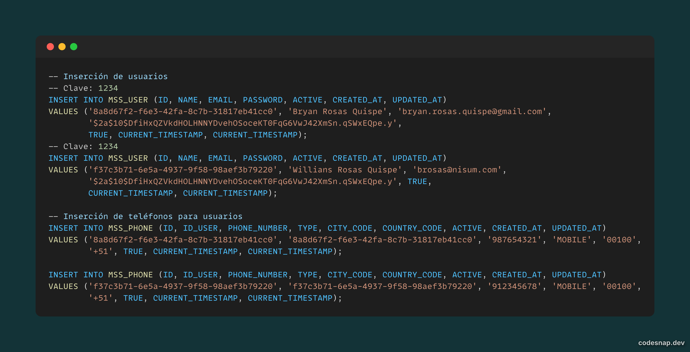
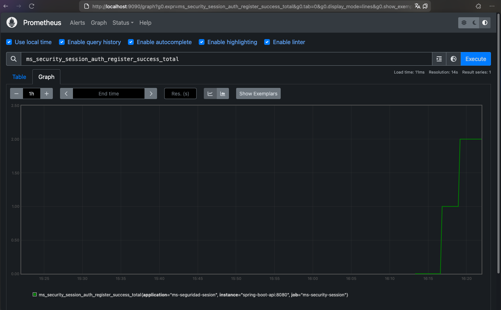

# Proyecto: Sistema de Seguridad de Sesión

Este proyecto consiste en una aplicación **Spring Boot** que gestiona la seguridad de sesiones para una plataforma
bancaria. Proporciona autenticación basada en JWT y expone diversas métricas de la aplicación para monitorización
mediante **Prometheus**.

---

## Tecnologías y Herramientas

- **Java 17**: Lenguaje de programación principal.
- **Spring Boot**: Framework para el desarrollo de aplicaciones Java.
    - Spring Security: Configuración de seguridad.
    - Spring Data JPA: Acceso a datos.
    - Spring Actuator: Métricas y monitoreo.
- **Liquibase**: Gestión de cambios en la base de datos.
- **H2 Database**: Base de datos en memoria para desarrollo y pruebas.
- **Swagger**: Documentación de la API.
    - Springdoc OpenAPI: Integración de Swagger con Spring Boot.
- **Lombok**: Simplifica la escritura de código boilerplate.
- **Prometheus**: Monitorización de métricas.
- **Docker Compose**: Orquestación de contenedores (Prometheus).
- **JUnit**: Framework de pruebas unitarias.

---

## Funcionalidades

- **Autenticación con JWT (JSON Web Token)**:
    - Generación de tokens tras la autenticación.
    - Validación y autorización basada en tokens.
- **Exposición de Endpoints Seguros y Públicos**:
    - Endpoints públicos como `/actuator`, `/swagger-ui`, entre otros.
    - Acceso controlado para endpoints protegidos.
- **Monitorización y Métricas**:
    - Métricas en `/actuator/prometheus`, listas para ser escrapeadas por Prometheus.
- **Configuración Centralizada de Seguridad Cors**:
    - Soporte para orígenes cruzados configurables.

---

## Informacion adicional
Puedes ver la wiki del proyecto y el kamban que se uso:
- [wiki](https://github.com/CodeTecnologyYT/ms-seguridad-sesion/wiki)
- [kamba](https://github.com/users/CodeTecnologyYT/projects/3)

## Requisitos Previos

Antes de ejecutar este proyecto, asegúrate de cumplir con los siguientes requisitos:

1. **Java 17 instalado**.
2. **Gradle**: Gestor de dependencias y compilación.
3. (Opcional) **Docker & Docker Compose**: Solo si deseas usar Prometheus para monitoreo.

---

## Configuración y Ejecución del Proyecto

### **1. Clona el repositorio**

```bash
git clone https://github.com/CodeTecnologyYT/ms-seguridad-sesion.git
cd ms-seguridad-sesion
```

### **2. Configuración del Proyecto**

La aplicacion por defecto esta configurada en el puerto `8080`

- Asegúrate de tener **Java 17** instalado y configurado en tu entorno.

Si quieres cambiar el puerto de la aplicacion puedes hacerlo en el archivo `application.properties` o `application.yml`
en el directorio `src/main/resources`.

```
# Configuración básica del servidor
server.port=8080
```

### **3. Ejecuta la Aplicación**

#### Consideraciones antes de ejecutar:

- La aplicacion corre en memoria y hace uso de liquibase para cargar la informacion esta informacion se encuentra en el
  archivo `src/main/resources/db/changelog/db.changelog-master.yaml`
  

Para iniciar la aplicación, puedes usar **Maven**:

```bash
./gradlew bootRun
```

La aplicación estará disponible en: [http://localhost:8080](http://localhost:8080)

### **4. Endpoints Disponibles**

| Endpoint                                | Método | Descripción                                 |
|-----------------------------------------|--------|---------------------------------------------|
| `/security/session/users/users/{email}` | `GET`  | Acceso público para operaciones de usuario. |
| `/security/session/auth/register`       | `POST` | Autenticación mediante JWT.                 |
| `/actuator/prometheus`                  | `GET`  | Métricas para Prometheus.                   |
| `/swagger-ui/**`                        | `GET`  | Documentación interactiva API (Swagger).    |
| `/api-docs/**`                          | `GET`  | Esquema de documentación OpenAPI.           |

### **5. Métricas con Prometheus (Opcional)**

1. Asegúrate de tener **Docker Compose** instalado en tu máquina.
2. Asegúrate de que tu aplicación esté corriendo en `http://localhost:8080`.
3. En la raíz del proyecto, crea un archivo `prometheus.yml` como el siguiente:



```yaml
global:
  scrape_interval: 15s

scrape_configs:
  - job_name: 'spring-boot-app'
    metrics_path: '/actuator/prometheus'
    static_configs:
      - targets: [ 'host.docker.internal:8080' ] # macOS/Windows
```

4. Crea un archivo `docker-compose.yml` en la raíz del proyecto para ejecutar Prometheus:

```yaml
version: "3.8"
services:
  prometheus:
    image: prom/prometheus:v2.45.0
    ports:
      - "9090:9090" # UI en http://localhost:9090
    volumes:
      - ./prometheus.yml:/etc/prometheus/prometheus.yml # Montar configuración
```

5. Ejecuta Prometheus:

```bash
docker-compose up
```

6. Accede a **Prometheus** en [http://localhost:9090](http://localhost:9090).

---

## Estructura del Proyecto
Se uso arquitectura limpia para el desarrollo de la aplicacion separando la logica de negocio(dominio), la aplicacion y la infraestructura

```plaintext
src
├── main
│   ├── java
│   │   └── pe.bci.banco.ms.seguridad.sesion.auth
│   │       ├── application       # Lógica de negocio (Casos de uso)
│   │       ├── domain            # Entidades del dominio
│   │       ├── infrastructure    # Configuración e integración (seguridad, JWT, etc.)
│   │       └── ...
│   └── resources
│       ├── application.properties # Configuración de la aplicación
│       └── ...
├── test
│   └── java                      # Pruebas unitarias
└── ...
```

---

## Ejecución de Pruebas

Este proyecto incluye **JUnit** para pruebas unitarias. Ejecútalas con:

```bash
./gradlew test
```
### Probar la aplicacion
Una vez que la aplicacion este corriendo puedes probar los endpoints de la aplicacion, para ello puedes usar el cliente de postman o swagger.

Puedes probar la aplicacion usando el cliente de postman, puedes importar el archivo `postman_collection.json` que se encuentra en la raiz del proyecto.
Tambien puede hacerlo por swagger ingresando a la ruta `http://localhost:8080/swagger-ui/index.html` y probando los endpoints.

### Probar en ambiente productivo

Para probar la aplicacion en ambiente productivo puedes usar el cliente de postman, puedes importar siguiente curl:

```shell
curl --location 'http://143.198.137.50:8080/security/session/auth/register' \
--header 'Content-Type: application/json' \
--data-raw '{
    "name": "Juan Rodriguez",
    "email": "juan@nisum.org",
    "password": "Hunter22",
    "phones": [
        {
            "number": "1234567",
            "citycode": "1",
            "countrycode": "57"
        }
    ]
}'
```


---

## Autor

**Bryan Rosas**  
*Versión:* 1.0.0, 10-04-2025

## Licencia

Este proyecto está sujeto a todas las restricciones y derechos de uso interno definidos por **BCI (Chile)**. El
contenido no puede ser distribuido ni modificado sin autorización previa.
